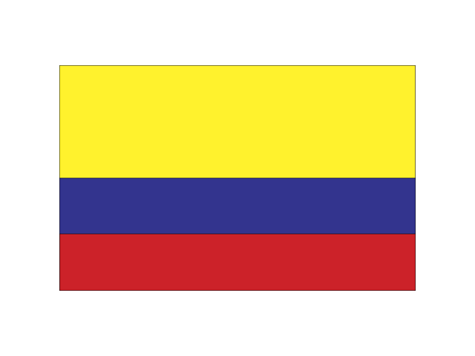
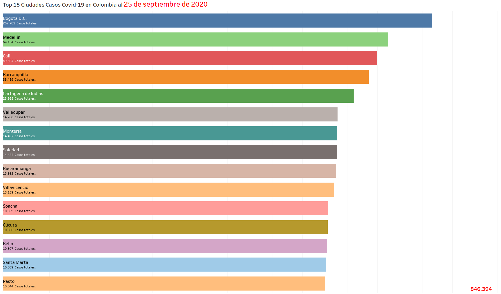

<!-- PROJECT SHIELDS -->
<!--
*** I'm using markdown "reference style" links for readability.
*** Reference links are enclosed in brackets [ ] instead of parentheses ( ).
*** See the bottom of this document for the declaration of the reference variables
*** for contributors-url, forks-url, etc. This is an optional, concise syntax you may use.
*** https://www.markdownguide.org/basic-syntax/#reference-style-links
-->
[![Contributors][contributors-shield]][contributors-url]
[![Forks][forks-shield]][forks-url]
[![Stargazers][stars-shield]][stars-url]
[![Issues][issues-shield]][issues-url]
[![MIT License][license-shield]][license-url]
[![LinkedIn][linkedin-shield]][linkedin-url]


<!-- PROJECT LOGO -->
<br />
<p align="center">
  <a href="https://github.com/jjnc2006/Covid19_Colombia">
    
  </a>

  <h1 align="center">Colombia Covid-19 Bar Chart Race by City in Tableau</h1>

  <p align="center">
    The goal of this project is to create a Bar Chart Race in Tableau with the Covid-19 cases by cities in Colombia.
    <br />
    <a href="https://github.com/jjnc2006/Covid19_Colombia"><strong>Explore the docs »</strong></a>
    <br />
    <br />
    <a href="https://github.com/jjnc2006/Covid19_Colombia">View Demo</a>
    ·
    <a href="https://github.com/jjnc2006/Covid19_Colombia/issues">Report Bug</a>
    ·
    <a href="https://github.com/jjnc2006/Covid19_Colombia/issues">Request Feature</a>
  </p>
</p>


<!-- TABLE OF CONTENTS -->
## Table of Contents

* [About the Project](#about-the-project)
  * [Built With](#built-with)
* [Getting Started](#getting-started)
  * [Prerequisites](#prerequisites)
  * [Installation](#installation)
* [Usage](#usage)
* [Roadmap](#roadmap)
* [Contributing](#contributing)
* [License](#license)
* [Contact](#contact)
* [Acknowledgements](#acknowledgements)


<!-- ABOUT THE PROJECT -->
## About The Project
<p align="justify">The purpose of this project is to practice my data manipulation and visualization skills. In the data manipulation phase 
I used two python libraries: Pandas and Numpy. Then, to export the Pandas data frame I did work with two python libraries 
oriented to export the panda's data frame to a Tableau file, those libraries are Plandeau and Tableausdk. Finally, to visualize 
the result data in a bar chart race I choose Tableau.
</p>
<p align="center">
  <a href="https://github.com/jjnc2006/Covid19_Colombia/blob/master/images/screenshot.png">
    
  </a>

### Built With

* [Python](https://www.python.org/)
* [Jupyter Notebook](https://jupyter.org/)
* [Tableau](https://www.tableau.com/)

<!-- GETTING STARTED -->
## Getting Started

To get a local copy up and running follow these simple steps.

### Prerequisites

1. You must have installed the latest version of Python. Personally, I recommend to use the Anaconda Package but, is not mandatory for this project.
2. You will need the following libraries/packages to be able to work with this repository:
* Pandas
```sh
pip install pandas
```
* Numpy
```sh
pip install numpy
```
* Pandleau
```sh
pip install pandleau
```
* Tableausdk

  Follow the instructions from the [Tableau's website](https://help.tableau.com/current/api/sdk/en-us/SDK/tableau_sdk_using_python.htm)

### Installation

1. Clone the repo
```sh
git clone https://github.com/jjnc2006/Covid19_Colombia.git
```

<!-- USAGE EXAMPLES -->
## Usage

1. The jupyter notebook has all the explanation about the processes done with pandas to manipulate the source data. Feel free to change as you which.

2. To see the original chart bar race in tableau go to [https://public.tableau.com/profile/datamadness/](https://public.tableau.com/profile/datamadness/#!/vizhome/colombia_covid_viz_ciudades/CasosCovid-19enColombia)

<!-- ROADMAP -->
## Roadmap

See the [open issues](https://github.com/jjnc2006/Covid19_Colombia/issues) for a list of proposed features (and known issues).


<!-- CONTRIBUTING -->
## Contributing

Contributions are what make the open source community such an amazing place to be learn, inspire, and create. Any contributions you make are **greatly appreciated**.

1. Fork the Project
2. Create your Feature Branch (`git checkout -b feature/AmazingFeature`)
3. Commit your Changes (`git commit -m 'Add some AmazingFeature'`)
4. Push to the Branch (`git push origin feature/AmazingFeature`)
5. Open a Pull Request


<!-- LICENSE -->
## License

Distributed under the GNU GENERAL PUBLIC LICENSE. See `LICENSE` for more information.


<!-- CONTACT -->
## Contact

Twitter: [@data_madness](https://twitter.com/data_madness)

Email: datamadness81@gmail.com

Linkedin: [https://www.linkedin.com/in/john-ramireztech/](https://www.linkedin.com/in/john-ramireztech/)

Project Link: [https://github.com/jjnc2006/Covid19_Colombia](https://github.com/jjnc2006/Covid19_Colombia)

Tableau: [https://public.tableau.com/profile/datamadness/](https://public.tableau.com/profile/datamadness/)

<!-- ACKNOWLEDGEMENTS -->
## Acknowledgements


<!-- MARKDOWN LINKS & IMAGES -->
<!-- https://www.markdownguide.org/basic-syntax/#reference-style-links -->
[contributors-shield]: https://img.shields.io/github/contributors/jjnc2006/Covid19_Colombia.svg?style=flat-square
[contributors-url]: https://github.com/jjnc2006/Covid19_Colombia/graphs/contributors
[forks-shield]: https://img.shields.io/github/forks/jjnc2006/Covid19_Colombia.svg?style=flat-square
[forks-url]: https://github.com/jjnc2006/Covid19_Colombia/network/members
[stars-shield]: https://img.shields.io/github/stars/jjnc2006/Covid19_Colombia.svg?style=flat-square
[stars-url]: https://github.com/jjnc2006/Covid19_Colombia/stargazers
[issues-shield]: https://img.shields.io/github/issues/jjnc2006/Covid19_Colombia.svg?style=flat-square
[issues-url]: https://github.com/jjnc2006/Covid19_Colombia/issues
[license-shield]: https://img.shields.io/github/license/jjnc2006/Covid19_Colombia.svg?style=flat-square
[license-url]: https://github.com/jjnc2006/Covid19_Colombia/blob/master/LICENSE.txt
[linkedin-shield]: https://img.shields.io/badge/-LinkedIn-black.svg?style=flat-square&logo=linkedin&colorB=555
[linkedin-url]: https://www.linkedin.com/in/john-ramireztech/
[product-screenshot]: images/screenshot.png
